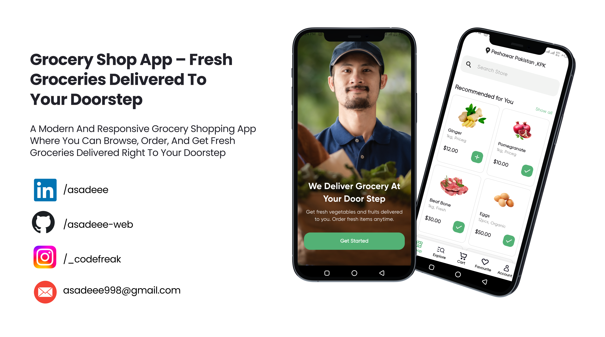

## 🚀 Getting Started

To get started with the project, clone the repository and run it locally:

```bash
git clone https://github.com/asadeee-web/grocery_shop.git
cd grocery_shop_app
flutter pub get
flutter run

```

## 📱 Preview

Here’s a sneak peek of the app design:



---

## 📌 Features

- Discover and explore groceries easily 
- Add items to Cart and manage Favourites  
- Browse groceries by Categories 
- Maintain their Profile for a personalized experience 
- Enjoy a clean & responsive UI across devices

---

## 🛠️ Tech Stack

- **Flutter** (Frontend)  
- **Getx** (Navigation)  
- **Provider** (State Management)  
- **Dart** (Programming Language)  

---

## 🤝 Contributing

Contributions are welcome! Feel free to fork this repo and submit a PR.

---


